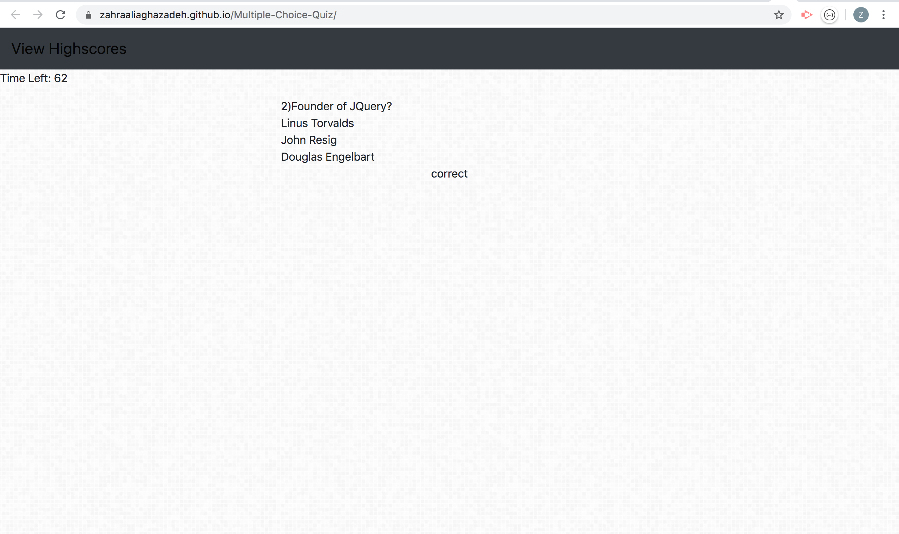

# [Code Quiz](https://zahraaliaghazadeh.github.io/Multiple-Choice-Quiz/)
## Simple Multiple choice quiz game with timer
This application is a multiple choice quiz. Once the user clicks on start, a timer of 75 seconds will start. By clicking on each wrong answer, it will subtract 5 seconds from the time left. The time left will be the score of the user at the end. I have had Math tutoring experience in the past and I have always wanted to create easy to grade solutions. This can be a great start for making such projects.
#### Screen Shot

#### Installation
To use this app you can click : [here](https://zahraaliaghazadeh.github.io/Multiple-Choice-Quiz/)

#### Usage
In order to use this application you can open the link, then answer the questions , it will tell you if you answered correct or incorrect. 

#### Contact
Email: zahraaliaghazadeh@gmail.com

LinkedIn: [LinkedIn](https://www.linkedin.com/in/yalda-aghazade-7a9b0390)

#### Licence
MIT license
copy right © Zahra Ali Aghazadeh

####  Areas of improvement

At the end of quiz there should be a submit button and a place to put name and then the quiz will display that in a list.

The shape of buttons look like text , they should be changed to buttons, but I already added the hover effect.

